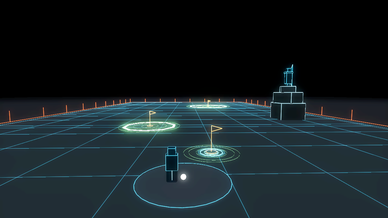

<!-- Generated by tests/walkthrough/test_walkthrough.gd from tests/holes/test_practice_range.gd. Do not edit this file: edit the suite, run the tests, commit what they wrote. -->

# 09 — The range

*Written by the suite from [`tests/holes/test_practice_range.gd`](../tests/holes/test_practice_range.gd). Every line under **What the suite asserts** is the name of a test that runs on every pull request, and its link is the assertion.*

The range as a whole: three pins, three clubs, and nothing that can be lost.

Most of what matters here is a *relationship* between numbers in different
files -- a pin's distance against its club's carry, the pins against the
boundary, the boundary against the archer. Those are the things that drift
when one of them is retuned, and this project has already shipped two bugs of
exactly that shape.

## What the suite asserts

- [There is a pin for each club](../tests/holes/test_practice_range.gd#L23)
- [Each pin is reachable by its own club and not by a full swing](../tests/holes/test_practice_range.gd#L32)
- [The pins get further away](../tests/holes/test_practice_range.gd#L50)
- [The pins are off axis from each other](../tests/holes/test_practice_range.gd#L61)
- [Each pin suggests a club but does not impose it](../tests/holes/test_practice_range.gd#L77)
- [Changing club is announced once](../tests/holes/test_practice_range.gd#L93)
- [A club index out of range is clamped rather than crashing](../tests/holes/test_practice_range.gd#L107)
- [The range opens with the club its first pin wants](../tests/holes/test_practice_range.gd#L115)
- [Everything the range asks for is inside the boundary](../tests/holes/test_practice_range.gd#L124)
- [A full driver stays on the range](../tests/holes/test_practice_range.gd#L144)
- [The lie detector agrees with the range it is built from](../tests/holes/test_practice_range.gd#L159)
- [The archer watches the range when it is defended](../tests/holes/test_practice_range.gd#L169)
- [It can be played without one](../tests/holes/test_practice_range.gd#L177)
- [The camera is placed before anything can look through it](../tests/holes/test_practice_range.gd#L181)
- [A defended range is a different range](../tests/holes/test_practice_range.gd#L191)
- [The camera does not whip round when the arrow reverses the ball](../tests/holes/test_practice_range.gd#L212)
- [The camera turns rather than cuts when the ball changes line](../tests/holes/test_practice_range.gd#L233)
- [A defender is blended into frame and not cut to](../tests/holes/test_practice_range.gd#L248)
- [The defender framing is capped however far away it is](../tests/holes/test_practice_range.gd#L269)
- [The first run has exactly one defender and it is on the rock](../tests/holes/test_practice_range.gd#L310)
- [The contender can be stood up and taken away](../tests/holes/test_practice_range.gd#L325)
- [The first run defends with the archer on the rock](../tests/holes/test_practice_range.gd#L338)
- [Taking the bow leaves the attract screen](../tests/holes/test_practice_range.gd#L352)
- [A range told to open on defence does so](../tests/holes/test_practice_range.gd#L365)
- [A range left to its default opens as the golfer](../tests/holes/test_practice_range.gd#L379)
- [The contender is held in preference when there is one](../tests/holes/test_practice_range.gd#L388)
- [A range with no defenders offers no side to switch to](../tests/holes/test_practice_range.gd#L395)
- [A held guard stops guarding by itself](../tests/holes/test_practice_range.gd#L404)
- [The contender stands at twice the distance to the pin](../tests/holes/test_practice_range.gd#L420)
- [A close putt is the players to lose](../tests/holes/test_practice_range.gd#L436)
- [The contender never stands outside the fence](../tests/holes/test_practice_range.gd#L453)
- [The contender cannot touch a putt](../tests/holes/test_practice_range.gd#L469)
- [The ball is held for the backswing](../tests/holes/test_practice_range.gd#L481)
- [The defence is the same gesture as the stroke](../tests/holes/test_practice_range.gd#L499)
- [Letting go looses an arrow that has to travel](../tests/holes/test_practice_range.gd#L516)
- [One arrow per stroke](../tests/holes/test_practice_range.gd#L533)
- [An arrow that hits nothing is simply gone](../tests/holes/test_practice_range.gd#L543)
- [The camera stands behind the archer when defending](../tests/holes/test_practice_range.gd#L557)
- [A hand played defender is never told it was unlucky](../tests/holes/test_practice_range.gd#L578)
- [Holding the archer stops it playing itself](../tests/holes/test_practice_range.gd#L593)
- [Switching sides changes what the drag means](../tests/holes/test_practice_range.gd#L606)
- [A good lead actually stops the ball](../tests/holes/test_practice_range.gd#L679)
- [Aiming at where the ball is misses it](../tests/holes/test_practice_range.gd#L696)
- [A harder draw needs less lead](../tests/holes/test_practice_range.gd#L713)
- [The pins come up in the order of pi in ternary](../tests/holes/test_practice_range.gd#L747)
- [Every digit is a pin](../tests/holes/test_practice_range.gd#L762)
- [The range never ends](../tests/holes/test_practice_range.gd#L773)
- [A made pin is the next line of play](../tests/holes/test_practice_range.gd#L798)
- [An idle player gets the tour](../tests/holes/test_practice_range.gd#L819)
- [The tour keeps moving while the player is idle](../tests/holes/test_practice_range.gd#L847)
- [The tour never jumps](../tests/holes/test_practice_range.gd#L857)
- [The tour turns from the view it leaves](../tests/holes/test_practice_range.gd#L894)
- [A player holding the camera is never idle](../tests/holes/test_practice_range.gd#L906)
- [A new pin resets the idle clock as a touch would not](../tests/holes/test_practice_range.gd#L918)
- [Reaching for a club is a touch](../tests/holes/test_practice_range.gd#L930)
- [The defend view is seven degrees right and pulled back](../tests/holes/test_practice_range.gd#L940)
- [The orbit swings around the player and not the line](../tests/holes/test_practice_range.gd#L961)
- [A round the game played alone is not written](../tests/holes/test_practice_range.gd#L985)
- [A round is a file of its own strokes and the list starts again](../tests/holes/test_practice_range.gd#L1000)

## As recorded

*Taken by the tests above, from the scene they asserted against, on the last run with a display. Recorded, never compared (ADR-031).*

*The range on its own, as the suite instantiates it: the golfer at the ball on the mat, three pins, and the archer on the tower.*

---

← [08 — The camera](08-the-camera.md) · [Index](README.md) · [10 — Defenders, and what is fair](10-defenders.md) →
