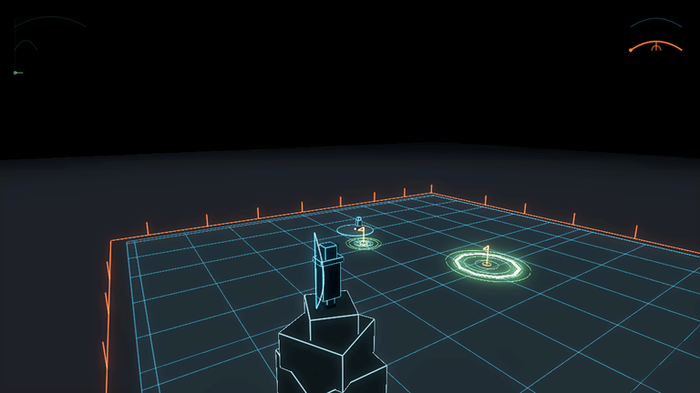
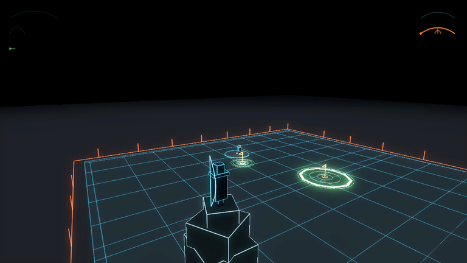

<!-- Generated by tests/walkthrough/test_walkthrough.gd from tests/walkthrough/registry.gd. Do not edit this file: edit the suite, run the tests, commit what they wrote. -->

# golfVs, by running it

One path through the game, in the order a newcomer meets it. The first page is written by hand and every command on it is checked against the tree. Every page after it is written **by the test suite**, from the suite: its prose is the suite's own header, each line under *what the suite asserts* is a test's name linking to the assertion, and each picture was taken by one of those tests from the scene it asserted against. A page here cannot say something the suite does not, because the suite wrote it (ADR-031).

1. [01 — Getting it running](01-getting-it-running.md)
2. [02 — The first thing you see](02-the-first-thing-you-see.md)
3. [03 — The club selector](03-the-club-selector.md)
4. [04 — The stroke](04-the-stroke.md)
5. [05 — The aim ribbon](05-the-aim-ribbon.md)
6. [06 — Ball flight](06-ball-flight.md)
7. [07 — Three clubs](07-three-clubs.md)
8. [08 — The camera](08-the-camera.md)
9. [09 — The range](09-the-range.md)
10. [10 — Defenders, and what is fair](10-defenders.md)
11. [11 — The archer](11-the-archer.md)
12. [12 — Stroke records](12-stroke-records.md)
13. [13 — The record schema](13-the-record-schema.md)
14. [14 — Canonical bytes](14-canonical-bytes.md)
15. [15 — Physics guarantees](15-physics-guarantees.md)
16. [16 — The harness and the pin](16-the-harness.md)
17. [17 — How this walkthrough is made](17-how-this-walkthrough-is-made.md)

## As recorded

Every picture the walkthrough has, in page order. Each was taken by a test from the scene it had just asserted against, on the last run with a display; the caption links to the page and the page links to the test.

*The first frame, from behind your archer on the tower: the game's golfer is at the ball down the range, and the switch in the corner hands you the club.* — [02 — The first thing you see](02-the-first-thing-you-see.md)

*The selector, fully faded up in its corner, before any stroke has been taken.* — [03 — The club selector](03-the-club-selector.md)

*The range on its own, as the suite instantiates it: the golfer at the ball on the mat, three pins, and the archer on the tower.* — [09 — The range](09-the-range.md)

## How it is kept true

- **Regenerating is running the tests.** `tests/walkthrough/test_walkthrough.gd` rewrites every generated page on every run of the suite; a page that changed is a diff in `git status`, and it is committed with the change that caused it.
- **Pictures need a display.** A headless run draws nothing and leaves the committed pictures alone; a run with a window -- the ordinary local run -- records them again. CI's walkthrough job deletes them all, runs the suite under a virtual display, and fails if any declared picture was not recorded.
- **Drift is red.** CI runs the suite and then `git diff --exit-code -- walkthrough`: a generated page that differs from the committed one fails the build.
- **The run that counts is on `main`.** A page that ran on a branch nobody merged has not run; [the CI history for `main`](https://github.com/quaternionmedia/golfvs/actions/workflows/ci.yml?query=branch%3Amain) is the evidence, not the presence of the workflow.
- **One registry.** `tests/walkthrough/registry.gd` is the only list: page order, titles, which suite, which pictures. Every suite under `tests/` must have a row, and every declared picture must be recorded, or the suite fails.
